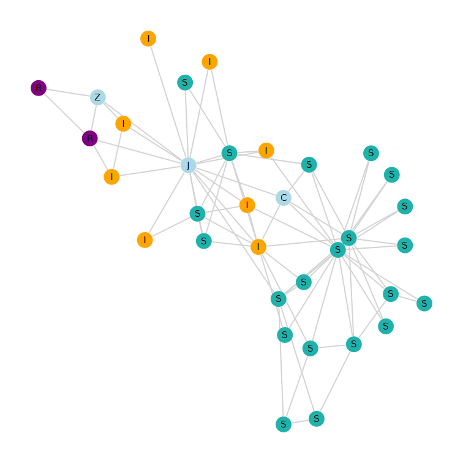

# Graph project: Epidemic spreading 

Projet Théorie des Graphes réalisé a l'enseeiht 2A Département Sciences du Numérique

## Description
In this work you will have to review different epidemic modelings relying all on the representation by graphs of a human network called a
 contact network A vertex in a contact network represents an individual and an edge between two vertices represents a contact between two individuals. The disease only spread from individual to individual if they are in contact, so through the edges.

## Auteurs
* **Saad MDAA** _alias_ [@smdaa](https://github.com/smdaa)
* **Younnes El BOUZEKRAOUI** _alias_ [@Younes-ops](https://github.com/Younes-ops)
## License

Ce projet est sous licence ``Anyone But INP-ENSEEIHT License`` - voir le fichier [LICENCE.md](LICENCE.md) pour plus d'informations